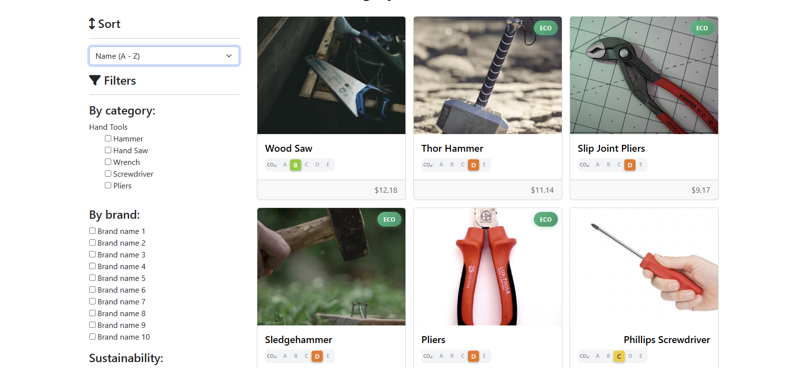

Bug Report Summary on test_bugs_site.feature:(Bug03 & Bug 04)
Bug -01:
Title: Logged-in user header shows “User Data not found” instead of username
Pre-requisite:
URL: https://with-bugs.practicesoftwaretesting.com/
Test Data: 
Username:customer@practicesoftwaretesting.com
Password: welcome01
Steps to reproduce:
Open the application URL in a browser.
Click Login (or navigate to the login page).
Enter valid credentials for an existing user.
Click Sign in / Submit
Observe the top navigation bar (header) after login.
Actual result:
User is successfully logged in, but the header shows “User Data not found
Expected result:
After successful login, the header should display the logged-in  username/full name 
NOTE: “User Data not found” should never appear for a valid authenticated user.
Screenshot:imge.png

Bug-02: Sorting filters work opposite to the expected behavior
Steps to Reproduce:
Navigate to the application URL in a browser
Go to the Shop 
Select a sorting any filter 
(e.g. Name(A-Z),Name(Z-A),Price(High-Low),Price(Low-High),Co2 rating(Best-First), Co2 rating(worst-First)).
Observe the product order after applying the filter.
Actual Result:
Products are sorted in the opposite way of the selected filter
e.g: Name(A-Z) is selected all Z products are displaying as in last product A
All the filters working in same way
Expected Result:
Products should be sorted according to the selected filter option
 Name(A-Z) is selected all A products are displaying as in last product Z
 

Bug 03: Incorrect navigation when clicking Home from Shop page
Steps to Reproduce:
Navigate to the application URL.
Go to the Shop page.
Click on the Home button.
Actual Result:User is redirected to the Contact page.
Expected Result:User should be redirected to the Home (Shop Home) page.

Bug 04: Quantity cannot be increased or on product page
Steps to Reproduce:
Navigate to the application URL.
Go to the Shop page.
Open the first product’s details page.
Click on the + button to increase the quantity.

Actual Result:
The + buttons are not working as product Quantity value does not change.
Expected Result:
Clicking + should increase the quantity (greater than 1).
NOTE: For this Bug screenshot will be displayed in report folder

Bug 05: Quantity cannot be decrease or on product page
Steps to Reproduce:
Navigate to the application URL.
Go to the Shop page.
Open the first product’s details page.
Click on the – button to decrease the quantity.
Actual Result:
The  – buttons are not working as product Quantity value does not change.
Expected Result:
Clicking – should decrease the quantity not less then 1

Bug 06 – Error Message When Adding Product to Cart
Expected Results:
When a user adds a product to the cart, the product should be added successfully and reflected in the cart without any error message.
Actual Results:
An error message (“Oops, something went wrong”) is displayed when the user attempts to add a product to the cart, and the product is not added successfully.

Bug 07 – Menu Text Typo (“Contact”)
Expected Result:
The application menu should display the text “Contact” correctly.
Actual Result:
The menu displays the text “Contakt” instead of “Contact”.

Bug 08 – Unable to Remove Product from Cart
Expected Result:
When a user removes a product from the cart, the product should be removed immediately and the cart should update accordingly.
Actual Result:
The product is not removed from the cart when the user attempts to remove it.

Bug 09 – Cart Quantity Limited to 10
Expected Result:
The user should be able to increase the product quantity beyond 10 if stock is available, or the system should clearly prevent further increases with a validation message.
Actual Result:
When the user increases the quantity beyond 10, the quantity automatically resets or defaults back to 10 without any warning or validation message.

Bug 10 – Billing Page Confirm Button Visibility
Expected Result:
The confirm button text on the billing page should be clearly visible with sufficient contrast against the background.
Actual Result:
The confirm button text uses the same or similar color as the background, making the text difficult or impossible to read.

Bug 11 – Payment Method Selection Does Not Update Fields
Expected Result:
When a user selects a payment method (e.g., Cash on Delivery), the payment-related fields should update dynamically based on the selected option.
Actual Result:
Selecting a payment method does not update or change the corresponding payment input fields.
